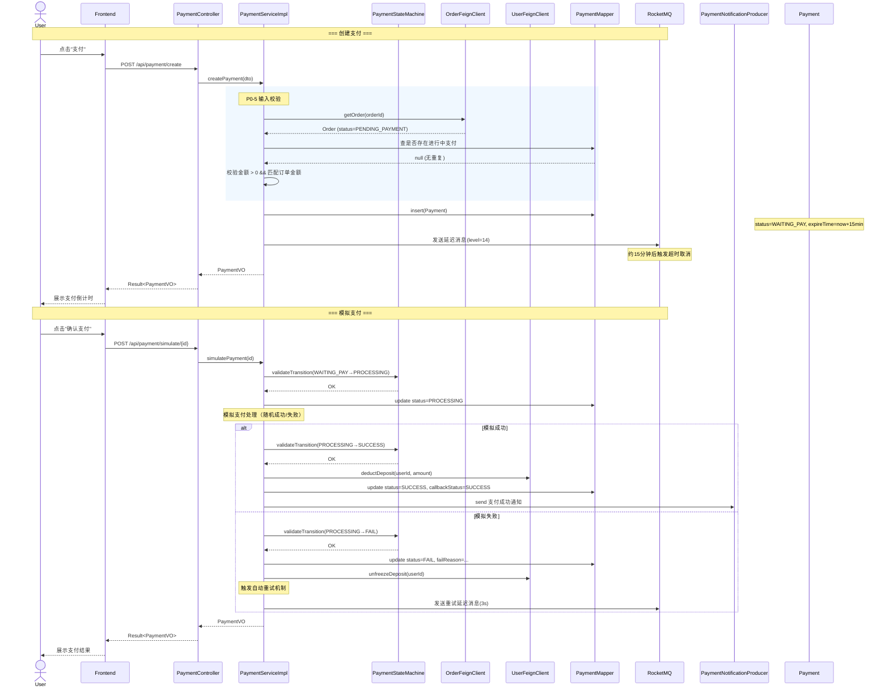
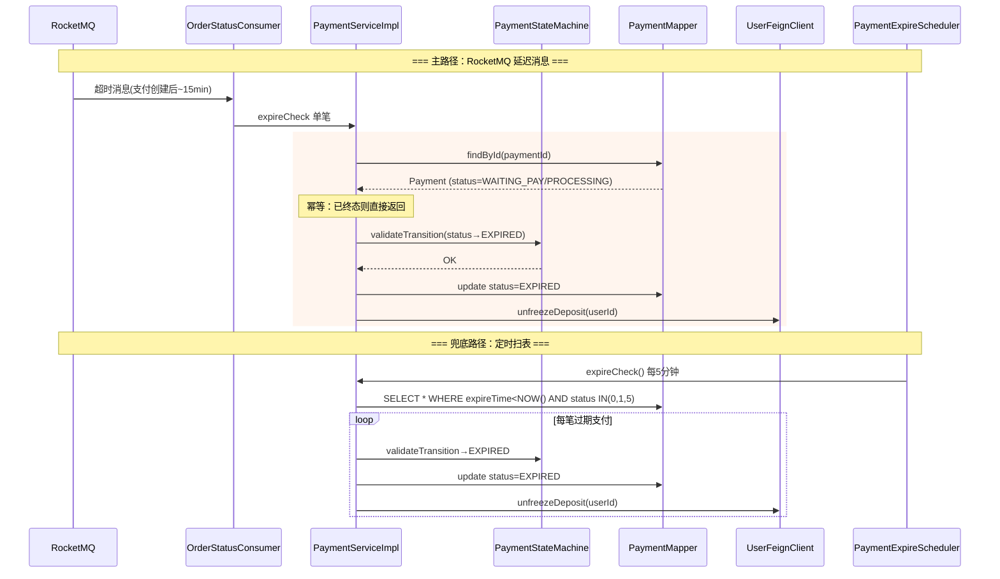
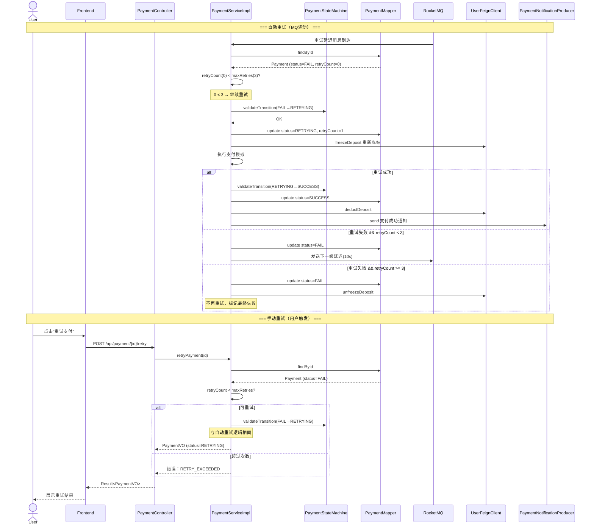
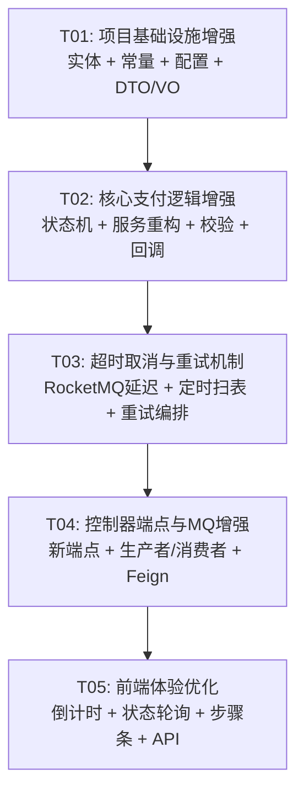

# 校园二手交易平台 — 支付模拟功能增强：增量系统设计与任务分解

> **作者**：高见远（架构师）  
> **日期**：2025-07-09  
> **版本**：v1.0  

---

## Part A：系统设计

---

### 1. 实现方案与框架选型

#### 1.1 核心技术挑战

| 挑战 | 说明 |
|------|------|
| 支付超时自动取消 | 15 分钟超时后需自动将支付标记为 EXPIRED，同时释放冻结的押金 |
| 失败自动重试 | 支付失败后最多重试 3 次，递增间隔（3s → 10s → 30s），需保证状态机完整性 |
| 支付回调幂等性 | 第三方回调可能重复投递，需通过 callbackStatus + expireTime 双重幂等校验 |
| 状态机安全性 | 需保证状态转换的合法性，防止非法跳转（如 EXPIRED → SUCCESS） |

#### 1.2 框架与库选型

| 技术点 | 选型 | 理由 |
|--------|------|------|
| 超时取消 | **RocketMQ 延迟消息 (level=14，约 15 分钟)** | 已有 RocketMQ 基础设施，延迟消息天然支持定时触发；配合定时任务（每 5 分钟扫表）作为兜底 |
| 失败重试 | **手动实现 + Redis 原子计数** | `@Retryable` 注解对状态机控制太弱（无法在 RETRYING 状态之间做业务操作如押金冻结/解冻），手动实现保证精细化控制 |
| 状态机 | **枚举 + 状态转移矩阵** | 轻量且可读，不引入 Spring State Machine 等重型框架 |
| 支付策略 | **保持简单，不引入策略模式** | PRD 明确当前仅模拟支付，无需微信/支付宝策略分支 |
| 前端轮询 | **Vue 3 `setInterval` + `onUnmounted` 清理** | 简单可靠，无需引入 WebSocket |
| 配置化 | **Nacos 配置中心** | 已有 Nacos，重试间隔/次数/超时时间均可热更新 |

#### 1.3 架构模式

- **后端分层**：Controller → Service → Mapper（保持现有分层）
- **状态机层**：独立 `PaymentStateMachine` 类，Service 层每次状态变更前先校验
- **MQ 层**：延迟消息用于超时取消；普通异步消息用于支付结果通知

---

### 2. 文件列表

标注：**MODIFY** = 修改已有文件，**NEW** = 新建文件

#### 2.1 payment-service

| 操作 | 文件路径 | 说明 |
|------|----------|------|
| MODIFY | `payment-service/src/main/java/com/campus/payment/entity/Payment.java` | 新增字段：expireTime、retryCount、callbackStatus、failReason、paymentMethod、callbackTime |
| MODIFY | `payment-service/src/main/java/com/campus/payment/PaymentStatusConstant.java` | 新增状态：PROCESSING(1)、EXPIRED(4)、RETRYING(5)；调整 SUCCESS→2, FAIL→3 |
| NEW | `payment-service/src/main/java/com/campus/payment/constant/PaymentErrorCode.java` | 支付错误码枚举 |
| NEW | `payment-service/src/main/java/com/campus/payment/state/PaymentStateMachine.java` | 状态转移矩阵与合法性校验 |
| MODIFY | `payment-service/src/main/java/com/campus/payment/dto/CreatePaymentDTO.java` | 增强校验注解 |
| NEW | `payment-service/src/main/java/com/campus/payment/dto/CallbackRequest.java` | 回调请求体 |
| NEW | `payment-service/src/main/java/com/campus/payment/dto/CallbackResponse.java` | 回调响应体 |
| NEW | `payment-service/src/main/java/com/campus/payment/vo/PaymentVO.java` | 前端支付视图对象 |
| MODIFY | `payment-service/src/main/java/com/campus/payment/service/PaymentService.java` | 新增方法签名：retryPayment、cancelPayment、queryByOrderId、handleCallback、expireCheck |
| MODIFY | `payment-service/src/main/java/com/campus/payment/service/impl/PaymentServiceImpl.java` | 核心逻辑增强：状态机集成、重试编排、超时处理、回调幂等、校验增强 |
| MODIFY | `payment-service/src/main/java/com/campus/payment/controller/PaymentController.java` | 新增端点：callback、by-order、retry、cancel、expire-check |
| NEW | `payment-service/src/main/java/com/campus/payment/config/RetryProperties.java` | 重试配置类（maxRetries、intervals） |
| MODIFY | `payment-service/src/main/java/com/campus/payment/mq/OrderStatusConsumer.java` | 新增超时取消消息处理 |
| MODIFY | `payment-service/src/main/java/com/campus/payment/mq/PaymentNotificationProducer.java` | 新增异步支付结果通知 |
| NEW | `payment-service/src/main/java/com/campus/payment/scheduler/PaymentExpireScheduler.java` | 定时扫表兜底（每 5 分钟） |
| MODIFY | `payment-service/src/main/resources/application.yml` | 新增重试与超时配置项 |

#### 2.2 campus-common

| 操作 | 文件路径 | 说明 |
|------|----------|------|
| NEW | `campus-common/src/main/java/com/campus/common/feign/OrderFeignClient.java` | 订单服务 Feign 客户端（若不存在则新建） |
| MODIFY | `campus-common/src/main/java/com/campus/common/mq/PaymentNotificationMessage.java` | 扩展字段：callbackStatus、failReason |
| MODIFY | `campus-common/src/main/java/com/campus/common/feign/UserFeignClient.java` | 确认 freezeDeposit / unfreezeDeposit / deductDeposit 方法签名完整 |

#### 2.3 campus-frontend

| 操作 | 文件路径 | 说明 |
|------|----------|------|
| MODIFY | `campus-frontend/src/views/PaymentPage.vue` | 集成倒计时组件、重试按钮、状态轮询、4 步骤条 |
| MODIFY | `campus-frontend/src/api/payment.ts` | 新增 API 方法：queryByOrderId、retryPayment、cancelPayment |
| MODIFY | `campus-frontend/src/views/OrderDetail.vue` | 支付状态展示增强（倒计时、重试入口） |
| MODIFY | `campus-frontend/src/views/OrderList.vue` | 支付状态列增强 |
| NEW | `campus-frontend/src/components/CountdownTimer.vue` | 倒计时组件（<5min 橙色，<1min 红色闪烁） |
| NEW | `campus-frontend/src/components/PaymentSteps.vue` | 支付流程 4 步骤条 |

---

### 3. 数据结构与接口

#### 3.1 Mermaid 类图

```mermaid
classDiagram
    class Payment {
        +Long id
        +String paymentNo
        +Long orderId
        +Long userId
        +BigDecimal amount
        +Integer status
        +String paymentMethod
        +LocalDateTime createTime
        +LocalDateTime updateTime
        +LocalDateTime expireTime
        +Integer retryCount
        +String callbackStatus
        +String failReason
        +LocalDateTime callbackTime
    }

    class PaymentStatusConstant {
        <<constant>>
        +int WAITING_PAY = 0
        +int PROCESSING = 1
        +int SUCCESS = 2
        +int FAIL = 3
        +int EXPIRED = 4
        +int RETRYING = 5
    }

    class PaymentErrorCode {
        <<enum>>
        PAYMENT_NOT_FOUND
        ORDER_NOT_EXIST
        ORDER_STATUS_INVALID
        AMOUNT_MISMATCH
        DUPLICATE_PAYMENT
        PAYMENT_EXPIRED
        RETRY_EXCEEDED
        STATE_TRANSITION_INVALID
        CALLBACK_ALREADY_PROCESSED
        CANCEL_NOT_ALLOWED
    }

    class PaymentStateMachine {
        -static Map~Integer, Set~Integer~~ transitions
        +static boolean canTransition(int from, int to)
        +static void validateTransition(int from, int to)
        +static Set~Integer~ getTerminalStates()
        +static boolean isTerminal(int status)
    }

    class CreatePaymentDTO {
        +Long orderId
        +BigDecimal amount
        +String paymentMethod
        +@NotNull @Positive BigDecimal amount
        +@NotNull Long orderId
    }

    class CallbackRequest {
        +String paymentNo
        +String callbackStatus
        +String failReason
        +String sign
        +Long timestamp
    }

    class CallbackResponse {
        +String code
        +String message
        +String paymentNo
    }

    class PaymentVO {
        +Long id
        +String paymentNo
        +Long orderId
        +BigDecimal amount
        +Integer status
        +String statusText
        +Integer retryCount
        +Integer maxRetries
        +String failReason
        +Long remainingSeconds
        +LocalDateTime expireTime
        +LocalDateTime createTime
    }

    class RetryProperties {
        +int maxRetries = 3
        +List~Long~ intervals = [3, 10, 30]
        +int expireMinutes = 15
    }

    class PaymentService {
        <<interface>>
        +PaymentVO createPayment(CreatePaymentDTO dto)
        +PaymentVO handleCallback(CallbackRequest req)
        +PaymentVO retryPayment(Long id)
        +void cancelPayment(Long id)
        +PaymentVO queryByOrderId(Long orderId)
        +void expireCheck()
        +PaymentVO simulatePayment(Long id)
    }

    class PaymentServiceImpl {
        -PaymentMapper paymentMapper
        -OrderFeignClient orderFeignClient
        -UserFeignClient userFeignClient
        -PaymentNotificationProducer notificationProducer
        -RocketMQTemplate rocketMQTemplate
        -PaymentStateMachine stateMachine
        -RetryProperties retryProperties
    }

    class PaymentController {
        +POST /api/payment/create
        +POST /api/payment/simulate/{id}
        +POST /api/payment/callback
        +GET /api/payment/by-order/{orderId}
        +POST /api/payment/{id}/retry
        +POST /api/payment/{id}/cancel
        +POST /api/payment/expire-check
        +GET /api/payment/{id}
    }

    class PaymentExpireScheduler {
        -PaymentService paymentService
        +void scanExpiredPayments()
    }

    PaymentService <|.. PaymentServiceImpl
    PaymentServiceImpl --> Payment : operates
    PaymentServiceImpl --> PaymentStateMachine : validates
    PaymentServiceImpl --> RetryProperties : configures
    PaymentVO --> Payment : maps from
    CreatePaymentDTO --> Payment : creates
    CallbackRequest --> Payment : updates
```

#### 3.2 API 端点清单

| 方法 | 路径 | 说明 | 请求体/参数 | 响应体 | P 级别 |
|------|------|------|------------|--------|--------|
| `POST` | `/api/payment/create` | 创建支付（已有，增强校验） | `CreatePaymentDTO` | `Result<PaymentVO>` | P0 |
| `POST` | `/api/payment/simulate/{id}` | 模拟支付（已有，增强状态机） | — | `Result<PaymentVO>` | P0 |
| `GET` | `/api/payment/{id}` | 查询支付详情（已有） | — | `Result<PaymentVO>` | P0 |
| `POST` | `/api/payment/callback` | 支付回调端点 | `CallbackRequest` | `Result<CallbackResponse>` | **P0** |
| `GET` | `/api/payment/by-order/{orderId}` | 按订单查支付 | — | `Result<PaymentVO>` | **P1** |
| `POST` | `/api/payment/{id}/retry` | 手动重试支付 | — | `Result<PaymentVO>` | **P1** |
| `POST` | `/api/payment/{id}/cancel` | 手动取消支付 | — | `Result<Void>` | **P1** |
| `POST` | `/api/payment/expire-check` | 批量过期检查 | — | `Result<Integer>` | **P1** |

---

### 4. 程序调用流程

#### 4.1 完整支付流程（创建 → 处理 → 回调 → 更新）



#### 4.2 超时取消流程



#### 4.3 失败重试流程



---

### 5. 待明确事项

1. **订单状态确认**：PRD 要求订单状态为 `PENDING_PAYMENT` 才能发起支付。需与订单服务负责人确认状态常量值，若 `OrderFeignClient` 不存在则需同步新建。
2. **RocketMQ 延迟消息 Level**：level=14 对应约 15 分钟，但 RocketMQ 开源版仅支持固定 18 个 level，实际 level=14 是约 10 分钟，level=15 是约 30 分钟。**建议方案**：发 level=14（~10min）延迟消息，消息消费后若发现 expireTime 未到，重新发一条 level=5（~5min）；或升级到商业版支持任意延迟。需团队确认。
3. **回调签名校验**：PRD P2-2 要求回调签名校验占位，建议预留 `CallbackRequest.sign` 字段和 `SignatureValidator` 接口但暂不实现，后续通过 Nacos 开关启用。需确认签名算法方向（HMAC-SHA256？RSA？）。
4. **模拟支付的成功/失败概率**：目前 `simulatePayment()` 是确定性还是随机性？PRD 中重试机制暗含"可能失败"的语义，建议使用可配置的概率（如 Nacos 中 `payment.simulate.fail-rate=0.3`），开发环境可设为高失败率以便测试重试流程。

---

## Part B：任务分解

---

### 6. 依赖包列表

#### 6.1 Maven（后端）

无需新增依赖，所有功能基于已有框架实现：

- **Spring Boot 3.2**：已有（无需新增）
- **RocketMQ Spring Boot Starter**：已有（延迟消息支持）
- **MyBatis-Plus 3.5**：已有（BaseMapper + LambdaQueryWrapper）
- **Seata**：已有（分布式事务）
- **Spring Validation**：已有（`@NotNull`、`@Positive`）
- **Spring Scheduling**：已有（`@Scheduled` 定时扫表）
- **Lombok**：已有

#### 6.2 npm（前端）

无需新增依赖：

- **Vue 3 + Composition API**：已有
- **Element Plus**：已有（倒计时展示、步骤条组件）
- **TypeScript**：已有
- **Axios**：已有

---

### 7. 任务列表（≤5 个任务）

> ⚠️ 硬性约束：最多 5 个任务，每个任务至少包含 3 个相关文件。

#### T01：项目基础设施增强

| 属性 | 内容 |
|------|------|
| **任务 ID** | T01 |
| **任务名称** | 项目基础设施增强：实体扩展 + 常量枚举 + 配置 + DTO/VO |
| **优先级** | P0 |
| **依赖** | 无 |
| **描述** | 1. 扩展 `Payment` 实体新增 6 个字段（expireTime、retryCount、callbackStatus、failReason、paymentMethod、callbackTime）；2. 扩展 `PaymentStatusConstant` 新增 PROCESSING/EXPIRED/RETRYING 状态，调整现有编号；3. 新建 `PaymentErrorCode` 枚举（10 个错误码）；4. 新建 `RetryProperties` 配置类（maxRetries=3, intervals=[3,10,30], expireMinutes=15）；5. 增强 `CreatePaymentDTO` 校验注解；6. 新建 `CallbackRequest`/`CallbackResponse` DTO；7. 新建 `PaymentVO` 视图对象；8. 更新 `application.yml` 配置项 |
| **涉及文件** | `Payment.java` (MODIFY)、`PaymentStatusConstant.java` (MODIFY)、`PaymentErrorCode.java` (NEW)、`RetryProperties.java` (NEW)、`CreatePaymentDTO.java` (MODIFY)、`CallbackRequest.java` (NEW)、`CallbackResponse.java` (NEW)、`PaymentVO.java` (NEW)、`application.yml` (MODIFY) |

#### T02：核心支付逻辑增强

| 属性 | 内容 |
|------|------|
| **任务 ID** | T02 |
| **任务名称** | 核心支付逻辑增强：状态机 + 服务重构 + 校验 + 回调处理 |
| **优先级** | P0 |
| **依赖** | T01 |
| **描述** | 1. 新建 `PaymentStateMachine` 状态转移矩阵（6 状态 × 合法转移表），提供 `canTransition()` / `validateTransition()` / `isTerminal()` 方法；2. 重构 `PaymentServiceImpl.createPayment()`：集成 `OrderFeignClient` 订单存在性校验、进行中支付重复检测、金额匹配校验；3. 重构 `PaymentServiceImpl.simulatePayment()`：集成状态机校验 WAITING_PAY→PROCESSING→SUCCESS/FAIL；4. 实现 `PaymentServiceImpl.handleCallback()`：回调幂等性处理（callbackStatus 重复校验）、状态更新、押金操作；5. 更新 `PaymentService` 接口签名；6. 增强 `PaymentMapper` 查询方法（LambdaQueryWrapper 条件查询） |
| **涉及文件** | `PaymentStateMachine.java` (NEW)、`PaymentServiceImpl.java` (MODIFY)、`PaymentService.java` (MODIFY)、`PaymentMapper.java` (MODIFY)、`PaymentController.java` (MODIFY - create/simulate/{id} 端点适配)、`OrderFeignClient.java` (NEW/MODIFY) |

#### T03：超时取消与重试机制

| 属性 | 内容 |
|------|------|
| **任务 ID** | T03 |
| **任务名称** | 超时取消与重试机制：RocketMQ 延迟消息 + 定时兜底 + 重试编排 |
| **优先级** | P0 |
| **依赖** | T02 |
| **描述** | 1. 修改 `PaymentServiceImpl.createPayment()` 发送 RocketMQ 延迟消息（超时取消）；2. 修改 `OrderStatusConsumer` 处理超时取消消息 → 调用 `expireCheck` 逻辑；3. 实现 `PaymentServiceImpl.retryPayment()`：retryCount 校验 → FAIL→RETRYING → 执行支付 → SUCCESS/FAIL/RETRYING（下一级延迟）；4. 实现 `PaymentServiceImpl.cancelPayment()`：仅 WAITING_PAY 状态可取消 → EXPIRED + 解冻押金；5. 实现 `PaymentServiceImpl.expireCheck()`：扫描 expireTime < now 且状态非终态的记录 → EXPIRED；6. 新建 `PaymentExpireScheduler` 定时任务（每 5 分钟 `@Scheduled`）作为兜底；7. 配置 Nacos 动态配置项 |
| **涉及文件** | `PaymentServiceImpl.java` (MODIFY)、`OrderStatusConsumer.java` (MODIFY)、`PaymentExpireScheduler.java` (NEW)、`RetryProperties.java` (MODIFY - 确认配置完整)、`PaymentStateMachine.java` (MODIFY - 终态判断集成)、`application.yml` (MODIFY) |

#### T04：控制器端点与 MQ 增强

| 属性 | 内容 |
|------|------|
| **任务 ID** | T04 |
| **任务名称** | 控制器端点与 MQ 增强：新端点 + MQ 生产者/消费者完善 + Feign 完善 |
| **优先级** | P1 |
| **依赖** | T03 |
| **描述** | 1. `PaymentController` 新增 5 个端点：`POST /callback`、`GET /by-order/{orderId}`、`POST /{id}/retry`、`POST /{id}/cancel`、`POST /expire-check`；2. `PaymentNotificationProducer` 增强：paySuccess/payFail/payExpired 三个消息发送方法，消息体包含完整字段；3. `OrderStatusConsumer` 增强：区分超时消息与订单状态消息（通过 message tag）；4. `PaymentNotificationMessage` 扩展字段；5. `UserFeignClient` 确认方法签名一致；6. `OrderFeignClient` 完善（若不存在则新建） |
| **涉及文件** | `PaymentController.java` (MODIFY)、`PaymentNotificationProducer.java` (MODIFY)、`OrderStatusConsumer.java` (MODIFY)、`PaymentNotificationMessage.java` (MODIFY)、`UserFeignClient.java` (MODIFY)、`OrderFeignClient.java` (NEW/MODIFY) |

#### T05：前端体验优化

| 属性 | 内容 |
|------|------|
| **任务 ID** | T05 |
| **任务名称** | 前端体验优化：倒计时组件 + 状态轮询 + 步骤条 + API 增强 |
| **优先级** | P1 |
| **依赖** | T04 |
| **描述** | 1. 新建 `CountdownTimer.vue` 组件：接收 expireTime，计算剩余秒数；<5min 橙色文字，<1min 红色闪烁；到期触发 `@timeout` 事件；2. 新建 `PaymentSteps.vue` 步骤条组件（4 步：提交订单→等待支付→支付处理→支付完成）；3. 改造 `PaymentPage.vue`：集成倒计时、步骤条、重试按钮、状态轮询（3s `setInterval`，`onUnmounted` 清理）、超时提示；4. 扩展 `payment.ts` API 层：`queryByOrderId`、`retryPayment`、`cancelPayment`；5. 更新 `OrderDetail.vue` / `OrderList.vue`：支付状态列的枚举映射（中文 + 颜色标签） |
| **涉及文件** | `CountdownTimer.vue` (NEW)、`PaymentSteps.vue` (NEW)、`PaymentPage.vue` (MODIFY)、`payment.ts` (MODIFY)、`OrderDetail.vue` (MODIFY)、`OrderList.vue` (MODIFY) |

---

### 8. 共享知识

```yaml
# ===== 状态码约定 =====
payment.status:
  0: WAITING_PAY  # 待支付
  1: PROCESSING   # 处理中
  2: SUCCESS      # 支付成功
  3: FAIL         # 支付失败
  4: EXPIRED      # 已过期
  5: RETRYING     # 重试中

# 终态集合: [SUCCESS(2), EXPIRED(4)]  —— FAIL(3) 不是终态，可重试

# ===== MQ Topic 约定 =====
topics:
  order-status-topic:     # 订单状态变更（已有）
  payment-notify-topic:   # 支付结果异步通知（已有）
  payment-delay-topic:    # 支付超时延迟消息（新增，level=14）
  payment-retry-topic:    # 支付重试延迟消息（新增，level 动态）

# tag 约定：
#   timeout_cancel: 超时取消消息
#   retry:          重试消息
#   payment_result: 支付结果通知

# ===== 错误码约定 =====
PaymentErrorCode:
  PAYMENT_NOT_FOUND:         "支付记录不存在"
  ORDER_NOT_EXIST:           "订单不存在"
  ORDER_STATUS_INVALID:      "订单状态不允许支付"
  AMOUNT_MISMATCH:           "支付金额与订单金额不匹配"
  DUPLICATE_PAYMENT:         "存在进行中的支付"
  PAYMENT_EXPIRED:           "支付已过期"
  RETRY_EXCEEDED:            "重试次数已用尽"
  STATE_TRANSITION_INVALID:  "状态转换非法"
  CALLBACK_ALREADY_PROCESSED:"回调已处理"
  CANCEL_NOT_ALLOWED:        "当前状态不允许取消"

# ===== API 统一响应格式 =====
Result<T>:
  code: Integer    # 200=成功, 4xx=客户端错误, 5xx=服务端错误
  data: T
  message: String

# ===== 前端路由约定 =====
# /payment/:orderId       → PaymentPage.vue (支付页面)
# /order/:id              → OrderDetail.vue (订单详情，含支付状态)

# ===== Nacos 配置键 =====
payment.retry.max-retries: 3
payment.retry.intervals: [3, 10, 30]    # 秒
payment.expire.minutes: 15
payment.expire.scheduler.cron: "0 */5 * * * ?"   # 每5分钟
payment.simulate.fail-rate: 0.3                  # 30% 模拟失败率

# ===== 回调幂等规则 =====
# callbackStatus == "SUCCESS" 已存在 → 返回 CALLBACK_ALREADY_PROCESSED
# status 为终态(SUCCESS/EXPIRED) → 返回 CALLBACK_ALREADY_PROCESSED
# expireTime < now → 拒绝回调，状态改为 EXPIRED

# ===== 数据库字段默认值 =====
# retry_count DEFAULT 0
# callback_status DEFAULT NULL
```

---

### 9. 任务依赖图



> **依赖链说明**：T01 → T02 → T03 → T04 → T05 为线性依赖，每完成一个任务后方可启动下一个。T01 和 T05 之间无直接依赖，若前后端并行开发，T05 可提前启动 UI 组件编写（mock 数据），待 T04 完成后对接真实 API。

---

*文档结束*
